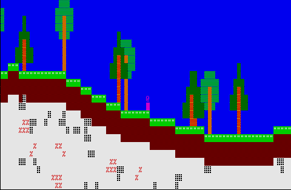
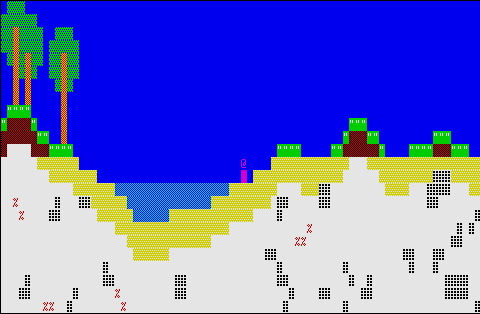
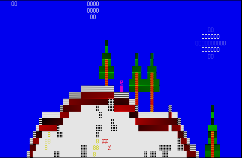
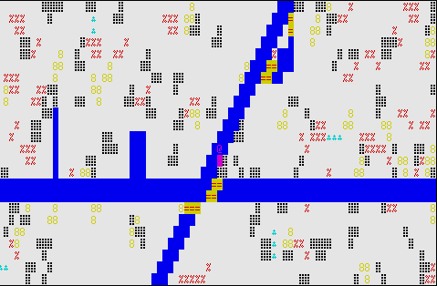
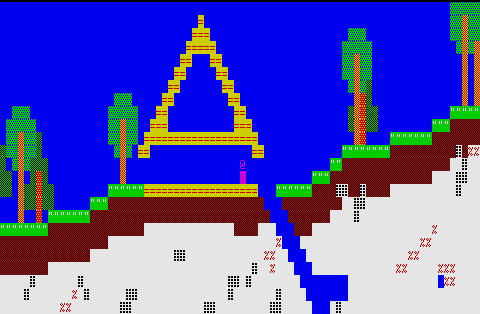
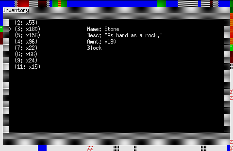

# 327 Craft

This is project 2 for COM S 327. For this open ended assignment, I made a 2D Minecraft clone in the console, 327 Craft. Although this game is barebones compared to the real Minecraft, and only in 2D, it still has quite a few core features.

This project uses CSV files to read data for the game. All files can be edited to change the looks and some functionality of the game. For instance, if the player wanted to add a new biome, such as a snowy, flat biome, they could do that without editing any code. New blocks, colors, and structures (like a building or tree) can all be added into the CSV files and will automatically be populated into the game without any code changes. The csv files are within the "data" folder.

For some background, I do game development as a hobby in my free time. I have made various projects similar to this one, including a terminal/console engine in C#, voxel engines in C# and C++, and other things. Doing a project like this wasn't too much of a stretch for me.

Note: I did use the FastNoiseLite library for noise. Noise is wildly complicated and I would of had to dedicate this whole project to learning how to generate noise if I had to make it myself.

## Features

* Randomly procedurally generated worlds, "infinite" in all directions.
* 4 biomes.

* Trees, ores, clouds, and other structures spawned throughout the world.

* Destroy and place blocks.

* Inventory viewing system.

* God mode (flying)(mostly for testing).

## How To Play

* To navigate menus, use the ARROW KEYS or the D-PAD. To select something on the menu, press 5 (center D-PAD), ENTER, or SPACE.

* In the game, to move around, use the 'w', 'a' 's', and 'd' keys. To sprint (move faster), hold down SHIFT or use CAPS LOCK.

* To break or place blocks, use the D-PAD or the ARROW KEYS. D-PAD is recommended if you have one. To toggle break mode or place mode, press ENTER. Press 0 to reset the break/place cursor.
  - In break mode, the block closest to you in the direction you press will be selected. Press the direction again, or 5 to break the block.
  - In place mode, you will move the cursor around manually using the keys. If the cursor is over an empty block (air), press 5 to place a Planks block in its place.

* To toggle "God mode" (flying and go through walls), press 'G'.

* To toggle "speed mode" (move at super fast speeds), press 'F'. This will only work if you are in God mode.

* Press ESCAPE to bring up the Pause menu. Pressing ESCAPE again will bring you back to the game.

* Press 'e' or 'i' to open your inventory. Use the menu navigation keys to look at different items in your inventory. Press 'e' or 'i' again to close it.

* Press 'Q' at any time to quit the game.

## Known Bugs
Occasionally, at local chunk Y == 1, there will be gaps/random missing blocks underground. I figured this is something to do with structure spawning, but I wasn't able to figure it out.